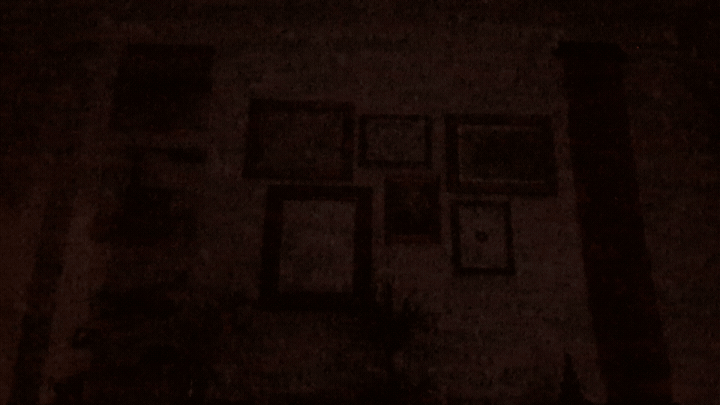
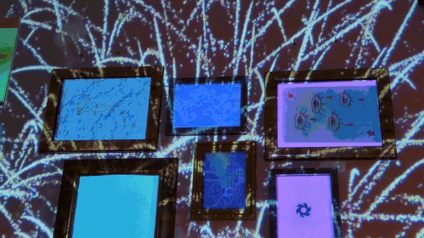

# Projection Engine

<div align="center">
  
</div>

Projection Engine is a C++ app. I used it to light up some of the stuff I have on the wall of my office. I don’t know what other uses it could have, but you can create new boxes, add text, calibrate them, and do a bunch of other nice things.
I left a few demo animations so the idea is easy to understand: just a few clouds, some pew-pium-piam flashes, and a couple of colorful, slightly epileptic previews, and more.
The idea is to animate using .txt files that define the step-by-step sequence of the desired animation.

---

## Quick Start

### 1. Build
```powershell
cmake -B build -G Ninja
cmake --build build
```

### 2. Run
```powershell
# Run on secondary display (projector)
.\build\PatronAnimation.exe 1

# Run on primary display (testing)
.\build\PatronAnimation.exe 0

# Start directly in Calibration mode
.\build\PatronAnimation.exe 0 --calibrate

# Run with a custom animation script
.\build\PatronAnimation.exe 0 --anim animations\sequential_wave.txt
```

> The binary name may vary depending on the current target name in CMake, but the application behavior and workflow remain the same.

---

## Main Modes & Controls

### Show & Animation Mode
Projects calibrated geometric areas and plays text-based animation sequences in real time.

| Key / Input | Action |
|:---|:---|
| <kbd>Left Click</kbd> / <kbd>Enter</kbd> | Advance to next segment / trigger cue |
| <kbd>Space</kbd> | Play / Pause animation |
| <kbd>R</kbd> | Restart animation from frame 1 |
| <kbd>Tab</kbd> | Switch to next animation script |
| <kbd>0</kbd> – <kbd>9</kbd> | Toggle individual area ON / OFF (by ID) |
| <kbd>A</kbd> / <kbd>O</kbd> | Turn **ALL** areas ON / OFF |
| <kbd>F1</kbd> | Enter **Calibration Mode** |
| <kbd>Esc</kbd> | Exit application |

### Calibration Mode (<kbd>F1</kbd>)
Interactive on-screen editor used to align corners to physical objects and define the projection surface.

| Key | Action |
|:---|:---|
| <kbd>Tab</kbd> / <kbd>Shift</kbd>+<kbd>Tab</kbd> | Select next / previous area |
| <kbd>0</kbd> – <kbd>9</kbd> | Select area directly (by ID) |
| Numpad <kbd>7</kbd> <kbd>9</kbd> <kbd>3</kbd> <kbd>1</kbd> | Select corner: **TL** / **TR** / **BR** / **BL** |
| Numpad <kbd>5</kbd> | Select **whole area** (moves all 4 corners) |
| <kbd>Q</kbd> / <kbd>E</kbd> | Cycle active corner |
| **Arrow keys** | Move 1 px (<kbd>Shift</kbd>: 10 px, <kbd>Ctrl+Shift</kbd>: 50 px) |
| <kbd>N</kbd> / <kbd>D</kbd> | **N**ew quad area / **D**uplicate area |
| <kbd>T</kbd> / <kbd>Shift</kbd>+<kbd>T</kbd> | New **T**ext box / **T**oggle type (quad/text) |
| <kbd>Shift</kbd>+<kbd>Delete</kbd> | Delete selected area |
| <kbd>Ctrl+Z</kbd> / <kbd>Ctrl+S</kbd> | Undo (50 levels) / Save configuration |
| <kbd>H</kbd> / <kbd>F1</kbd> | Toggle HUD panel / Return to Show mode |

---

## Animation Scripts (`animations/*.txt`)

Create custom light shows by editing plain `.txt` files:

```text
name: Sequential Wave
loop: true
default_step: 300ms

# Step 1: Start with all lit
300ms ALL_ON

# Step 2: Turn off one by one
100ms OFF 1
100ms OFF 2
...

# Step 3: Turn on one by one
100ms ON 1
100ms ON 2
```

- **Supported commands**: `ALL_ON`, `ALL_OFF`, `ON <id>`, `OFF <id>`, `TOGGLE <id>`, `MASK <bits>`, `WAIT <duration>`, `WAIT_CLICK` (pause until left mouse click), `IMAGE <id> <name>` (render image centered and cropped inside area borders), `CLEAR_IMAGE <id/ALL>`, `CLEAR_IMAGES` / `ALL_WHITE` (clear all images and restore white solid squares), `PRELOAD <name>` (preload image into memory), `TEXT <id> [font] [size] "<text>"` (renders text with zero background, strictly inside quad boundaries), `CLEAR_TEXT <id/ALL>` (removes projected text).
- **Headers**: `name:`, `loop: true/false`, `default_step: <duration>`, `reset_images: true` (ensures all squares start clean and white), `preload_images: <img1, img2>` (preloads and decodes images at startup for zero-delay playback).
- **Segments / Cues**: Split your show into interactive mouse-controlled sections with `WAIT_CLICK` or `SEGMENT: <title>`.
- **Timing**: Use `ms` (e.g. `100ms`) or `s` (e.g. `0.5s`).
- Combine actions on the same line with `&` (e.g. `300ms ON 1 & OFF 2`).

---

## Project Structure

```text
projection_engine/
├── animations/         # Plain text animation scripts (*.txt)
├── config/             # pattern_config.json (canvas size & calibrated corners)
├── images/             # Target pattern reference images
├── src/
│   ├── anim/           # Animation sequencer & script parser
│   ├── app/            # Application lifecycle & main loop (60 FPS)
│   ├── calib/          # Calibration controller & undo stack
│   ├── display/        # Multi-monitor detection & borderless window
│   ├── model/          # Quad geometry & JSON configuration I/O
│   └── render/         # Double-buffered GDI engine with alpha HUD
├── CMakeLists.txt      # Build configuration (MinGW + Ninja)
├── README.md           # Project documentation
└── third_party/        # Third-party dependencies
```

<div align="center">
  
</div>
